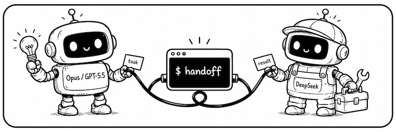
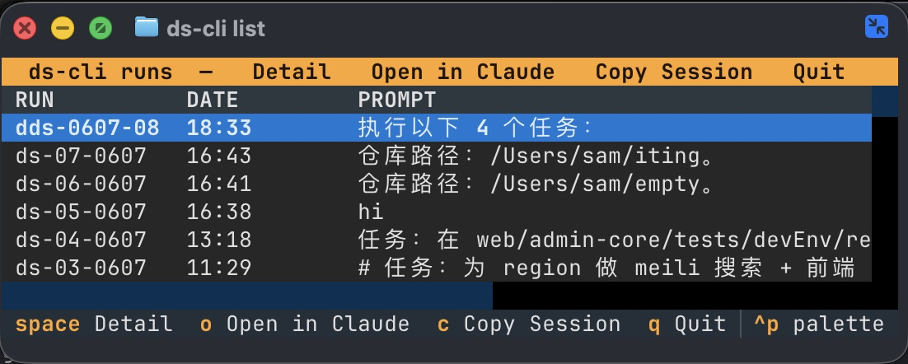
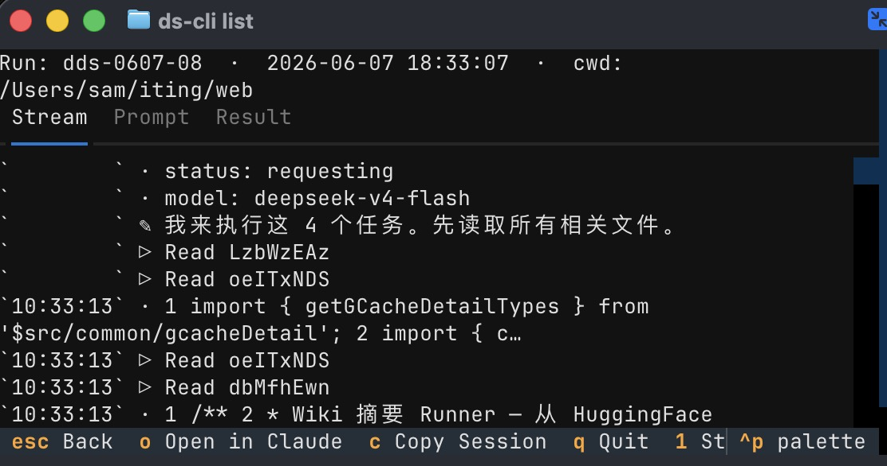
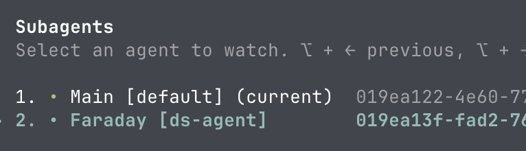

<div align="center">


# With **Handoff**, your coding agents can finally work together.


| coding agent | → Hand off to | Why |
| :-- | :-- | :-- |
| Claude Code / Codex | **DeepSeek** | Execution work is fast and cheap; save the expensive quota for decisions |
| DeepSeek | **Codex / Opus** | Borrow a brain for hard problems, bring the answer back to your session |

No tool-switching, no lost context.

**English** · [简体中文](README.zh-CN.md)

</div>

## Why handoff

If you use more than one coding agent, these will sound familiar:

- 💸 **"Claude / Codex: the $20 plan never lasts. The $100 plan costs too much."**<br>
  — Just say: *"Give this task to `/handoff-ds`."* DeepSeek does the work fast and cheap. Save your expensive quota for decisions.
- 🤔 **"DeepSeek is stuck. I want a second opinion from Codex."**<br>
  — Just say: *"Ask `/handoff-codex` what it thinks."* No new terminal. No re-explaining. The answer comes back to your current session.
- 🔁 **"I want to continue that task from before."**<br>
  — Just say: *"Resume that `/handoff-ds` session."* Everything is still there: the files it changed, the code it read, what it concluded.
- 🔄 **"A new model means a new session. I have to explain everything again."**<br>
  — Don't switch. Stay in your session. handoff passes the task over, then brings the result back.

**Do the math:** for transactional work — writing code, running tests — DeepSeek V4 matches Sonnet-class models at a fraction of the price. What is really scarce, and worth a subscription, is the judgment of the one or two models at the very top (Opus / GPT-5.5).

| Option | Relative cost for the same work |
| --- | --- |
| Claude Sonnet | 1× (baseline) |
| DeepSeek official API | **1/3** |
| [OpenCode Go](https://opencode.ai/go?ref=D5926WCTD8) (includes DeepSeek V4) | **1/18** |

Let the top model talk to you, split the work, and review; hand all execution off — **a $20 subscription directing $5 of compute gets you ~$200 worth of work.** That's all there is to it: one sentence inside your agent session.

## Quick start

### 1. Install

```bash
uv tool install handoff-cli
handoff init        # creates the config, links skill / agent files
```

Upgrade with `uv tool upgrade handoff-cli`.

### 2. Set your token

opus / codex reuse your local claude / codex logins — zero config. **Only DeepSeek needs a token.**

For DeepSeek compute we recommend the [OpenCode Go plan](https://opencode.ai/go?ref=D5926WCTD8) (lowest cost, includes DeepSeek V4). Once you have a key, edit `~/.handoff/config.yaml` and change just the `ANTHROPIC_AUTH_TOKEN` line:

```yaml
# ~/.handoff/config.yaml — handoff init generates this for you
backends:
  deepseek:                          # ← first = default
    type: claude
    model: deepseek-v4-flash
    pro_model: "deepseek-v4-pro[1m]"
    env:
      ANTHROPIC_BASE_URL: https://api.deepseek.com/anthropic
      ANTHROPIC_AUTH_TOKEN: "sk-..."  # ← change this. Local proxy setup: https://github.com/iTzFaisal/oc-cc-proxy
      ANTHROPIC_MODEL: "{model}"

  opus:                              # local claude login — zero config
    type: claude
    ...
  codex:                             # local codex login — zero config
    type: codex
    ...
```

### 3. Dispatch your first task

Go back to Claude Code and say:

> Make a plan, then hand it to `/handoff-ds`.

The task runs in the background; your session is never blocked. When it finishes, the agent reads the result and reports back.

### 4. Who you can hand work off to

| What you say | From | Hands off to | Best for |
| --- | --- | --- | --- |
| `/handoff-ds` | Claude Code | DeepSeek V4 | Execution work: writing code, running tests, refactors, bulk edits |
| `handoff-ds` (subagent) | Codex | DeepSeek V4 | Same as above — use this when you're inside Codex |
| `/handoff-codex` | Claude Code | Codex (GPT-5.5) | Heavy reasoning, second opinions, hard bugs |
| `/handoff-opus` | Claude Code | Claude Opus | Decisions that deserve the top model |

> Codex has no slash commands, so that row is the subagent of the same name — say "have `handoff-ds` execute the task above."

### 5. Watch progress / browse history

Inside Claude Code, expand the background shell and the live progress is right there — it renders in the shell view and uses none of your main session's context. To browse history or follow a task on its own, use `handoff list` and `handoff tail` (see the FAQ below).

## FAQ

<details>
<summary><b>How do I browse the task list or watch a task's progress?</b></summary>

<br>

Dispatching and resuming are the AI's job (`handoff run` / `handoff resume` under the hood). These two commands are for you — browse the list, watch the progress:

<table>
<tr>
<td width="50%" valign="top">

**`handoff list` / `handoff ls`** — interactive TUI over your full task history. See the full prompt, live status, and final result; press `G` on a row to reload that conversation and keep chatting.

</td>
<td width="50%" valign="top">

**`handoff tail <run-id>`** — follow a task's output stream live, like looking over its shoulder.

</td>
</tr>
<tr>
<td valign="top">

<!-- docs/assets/list-tui.jpg — ~480px wide — TUI list + detail view, highlight G/C shortcuts -->


</td>
<td valign="top">

<!-- docs/assets/tail.jpg — ~480px wide — handoff tail live stream -->


</td>
</tr>
</table>

</details>

<details>
<summary><b>Can I dispatch several tasks at once?</b></summary>

<br>

Yes. Have your agent send off several tasks in one message. Each runs on its own and reports back on its own — they never get in each other's way.

<!-- docs/assets/parallel.jpg — ~621px wide — 2–3 background tasks from one message, each with its own RESULT= path -->


</details>

<details>
<summary><b>No uv / installing from source?</b></summary>

<br>

`pipx install handoff-cli` or `pip install handoff-cli` work just as well. From source:

```bash
git clone https://github.com/dazuiba/handoff && cd handoff
uv tool install -e .
handoff init
```

</details>

<details>
<summary><b>How do I add a custom backend / what goes in the env block?</b></summary>

<br>

Add one more entry under `backends` — any Anthropic-compatible endpoint works:

```yaml
backends:
  kimi:
    type: claude
    model: kimi-k3
    env:
      ANTHROPIC_BASE_URL: https://api.moonshot.cn/anthropic
      ANTHROPIC_AUTH_TOKEN: "${MOONSHOT_API_KEY}"
      ANTHROPIC_MODEL: "{model}"
```

The env block is entirely yours — every key=value you set is exported before the CLI launches. `{model}` substitutes the resolved model name, `${ENV_VAR}` expands from your shell. Run `handoff env` to see where everything lives. Full details: **[configuration docs (Chinese) →](docs/configuration.zh-CN.md)**.

</details>

<details>
<summary><b>How does it actually work?</b></summary>

<br>

1. Your agent hands the whole task to handoff, which runs it **in the background** — your session never blocks.
2. handoff launches the matching CLI (`claude -p` / `codex exec`) in an isolated context and streams the full output to disk.
3. The main session receives exactly one line: `RESULT=<path-to-result-file>`. Progress goes to the background shell view — **never** into your main context.
4. On completion the agent gets notified, reads the result file, and reports back to you.
5. The `RESULT=` path is also a stable handle for the conversation: every follow-up round resumes the same session.

</details>

**More docs**

- **[CLI reference (Chinese) →](docs/cli-reference.zh-CN.md)** — full usage of `run` / `resume` / `list` / `tail` / `env` / `init`, run-id encoding, on-disk file layout.
- **[Configuration (Chinese) →](docs/configuration.zh-CN.md)** — mechanism vs data layers, env block, `${ENV}` interpolation, include, custom backends.
- **[Design notes (Chinese) →](docs/design.zh-CN.md)** — why Claude Code uses background shells while Codex uses a subagent; the RESULT= protocol.
